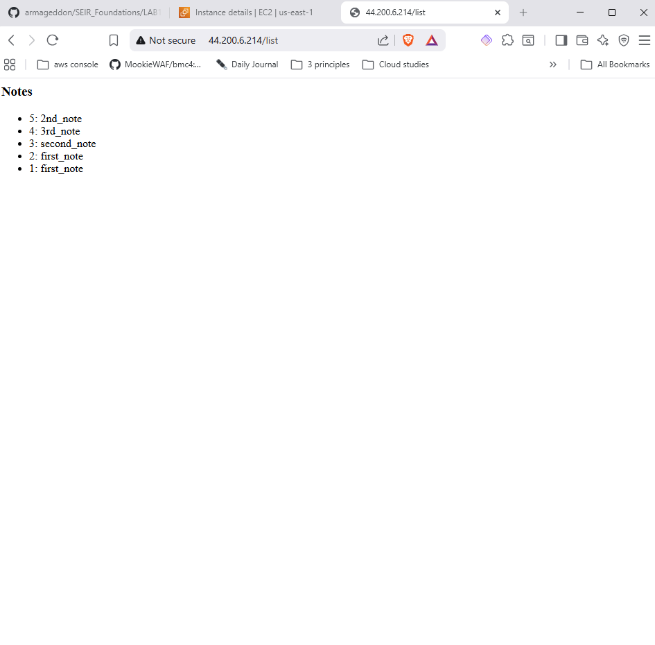
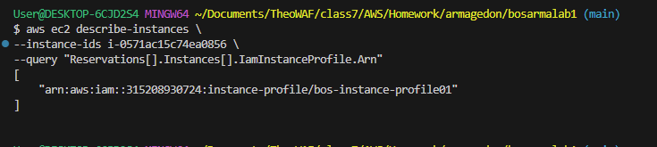
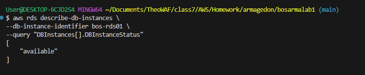

1. EC2 instance running and reachable over HTTP

2. RDS MySQL instance in the same VPC

3.Security group rule showing:
RDS inbound TCP 3306

Source = EC2 security group (not 0.0.0.0/0)

IAM role attached to EC2 allowing Secrets Manager access

## Application Proof
1. Successful database initialization
2. Ability to insert records into RDS
3. Ability to read records from RDS
4. Screenshot of:
* RDS SG inbound rule using source = sg-ec2-lab
* EC2 role attached
http://<EC2_PUBLIC_IP>/init

* http://<EC2_PUBLIC_IP>/add?note=first_note
* 
* http://<EC2_PUBLIC_IP>/add?note=last_note
* http://<EC2_PUBLIC_IP>/list
* 
* 

## C.Verification Evidence
* CLI output proving connectivity and configuration
* Browser output showing database data
* Copy and paste this command your vscode terminal
* 
* 
6. Technical Verification
## 6.1 Verify EC2 Instance
 204810](pictures/Screenshot%202026-01-10%20204810.png)

##### 6.2 Verify IAM Role Attached to EC2

#### 6.3 Verify RDS Instance State

#### 6.4 Verify RDS Endpoint (Connectivity Target)

#### 6.5 (works)

### 6.6 (run command inside ec2 sessions manager) (works)

